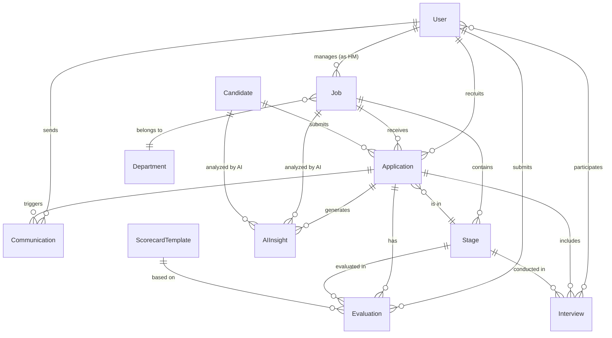

# Product Requirements Document (PRD)
## LTI ATS - Applicant Tracking System

**Version:** 1.0  
**Date:** November 25, 2025  
**Status:** Draft  
**Owner:** Product Team  

---

## Executive Summary

LTI ATS is a next-generation Applicant Tracking System that transforms reactive recruitment into an intelligent, collaborative, and data-driven process. By integrating artificial intelligence at every stage of the hiring lifecycle, from job posting to candidate onboarding, LTI ATS enables HR teams to reduce time-to-hire by 40% while focusing on strategic decision-making rather than administrative tasks.

### Product Vision

To become the leading AI-powered recruitment platform that empowers organizations to make better hiring decisions through intelligent automation, real-time collaboration, and predictive insights.

---

## 1. Product Overview

### 1.1 Problem Statement

Organizations face significant challenges in their recruitment processes:

1. **Manual and Time-Consuming Processes**: Recruiters spend 60-70% of their time on administrative tasks rather than strategic candidate engagement
2. **Lack of Effective Collaboration**: Disconnected communication between recruiters, hiring managers, and interviewers leads to delays and misalignment
3. **Subjective Hiring Decisions**: Decisions are often based on gut feeling rather than data-driven insights, leading to poor hiring outcomes
4. **Fragmented Tools**: Multiple disconnected systems create inefficient workflows and data silos
5. **Poor Candidate Experience**: Lack of transparency and communication results in negative candidate experiences and brand damage

### 1.2 Target Users

#### Primary Segments

**Early Adopters**
- Tech startups with 50-200 employees
- Progressive HR teams embracing AI and automation
- Organizations with rapid hiring needs

**Primary Market**
- Mid-market companies with 200-2,000 employees
- Established HR departments looking to modernize
- Companies with multiple departments and locations

**Secondary Segment**
- Specialized recruitment agencies
- Talent acquisition firms
- RPO (Recruitment Process Outsourcing) providers

### 1.3 Value Proposition

**LTI ATS reduces time-to-hire by 40% through intelligent automation and real-time collaboration, allowing HR teams to focus on strategic decisions rather than administrative tasks.**

#### Key Benefits

- **For Recruiters**: Reduce administrative burden by 60%, focus on high-value candidate engagement
- **For Hiring Managers**: Make data-driven hiring decisions with AI-powered insights and structured evaluations
- **For Candidates**: Transparent, modern experience with real-time updates and clear communication
- **For Organizations**: Improve quality of hire, reduce costs, and build competitive talent pipelines

---

## 2. Key Differentiators

### 2.1 Contextual AI Engine

Unlike traditional ATS platforms that rely on simple keyword matching, LTI ATS employs advanced semantic analysis to:
- Understand the context of job roles and organizational culture
- Predict candidate-job fit using historical success patterns
- Generate intelligent recommendations that improve over time

### 2.2 Native Collaboration

Built-in real-time collaboration features including:
- Live commenting and evaluation sharing
- Synchronized scorecard completion
- Collaborative decision-making workflows
- Integrated team debriefs with live data

### 2.3 Adaptive Automation

AI that learns from team decisions to:
- Automatically adjust filtering criteria
- Refine evaluation parameters
- Optimize candidate recommendations
- Improve matching accuracy over time

### 2.4 Predictive Analytics

Advanced analytics dashboard providing:
- Time-to-hire predictions by role and department
- Funnel analysis with bottleneck detection
- Source effectiveness and ROI tracking
- Early warning system for candidate drop-off

### 2.5 Premium Candidate Experience

Dedicated candidate portal featuring:
- Real-time application status updates
- Two-way communication channels
- Transparent process timelines
- Mobile-optimized interface

---

## 3. Core Features & Requirements

### 3.1 Job Management

#### Requirements

**JM-001: Job Requisition Creation**
- **Priority**: P0 (Must Have)
- **Description**: Allow recruiters to create job requisitions using intelligent templates
- **Acceptance Criteria**:
  - Smart templates suggest required skills based on similar roles
  - AI generates SEO-optimized job descriptions
  - Support for custom fields and structured data
  - Version history and draft saving

**JM-002: Approval Workflow**
- **Priority**: P0 (Must Have)
- **Description**: Configurable multi-step approval process
- **Acceptance Criteria**:
  - Customizable approval chains by department/role
  - Email and in-app notifications to approvers
  - Approval history and audit trail
  - Ability to reject with comments and request revisions

**JM-003: Multi-Channel Publishing**
- **Priority**: P0 (Must Have)
- **Description**: Automated posting to multiple job boards and platforms
- **Acceptance Criteria**:
  - Integration with LinkedIn, Indeed, Glassdoor
  - Company careers page posting
  - Social media sharing capabilities
  - Scheduled publishing support

**JM-004: Market Analysis**
- **Priority**: P1 (Should Have)
- **Description**: Salary benchmarking and market insights
- **Acceptance Criteria**:
  - Real-time salary range recommendations
  - Competitive analysis by location and role
  - Industry benchmark data integration
  - Market demand indicators

### 3.2 Sourcing & Attraction

**SA-001: Advanced Candidate Search**
- **Priority**: P0 (Must Have)
- **Description**: Boolean search capabilities in internal database
- **Acceptance Criteria**:
  - Boolean operators (AND, OR, NOT)
  - Fuzzy matching for skills and job titles
  - Saved search filters
  - Search result ranking by relevance

**SA-002: External Platform Integration**
- **Priority**: P0 (Must Have)
- **Description**: Connect to LinkedIn Recruiter, Indeed, GitHub
- **Acceptance Criteria**:
  - OAuth authentication for platforms
  - Real-time profile import
  - Data mapping and normalization
  - Duplicate detection and merging

**SA-003: Chrome Extension**
- **Priority**: P1 (Should Have)
- **Description**: Browser extension for quick profile import
- **Acceptance Criteria**:
  - One-click profile capture from LinkedIn
  - Auto-fill candidate information
  - Associate with specific job openings
  - Works across major recruitment platforms

**SA-004: Talent Pools**
- **Priority**: P1 (Should Have)
- **Description**: Segmented talent communities for passive candidates
- **Acceptance Criteria**:
  - Create custom talent pools by criteria
  - Automated nurturing campaigns
  - Pool analytics and engagement metrics
  - Easy activation for new job openings

### 3.3 Intelligent Screening

**IS-001: Automated CV Parsing**
- **Priority**: P0 (Must Have)
- **Description**: Extract structured data from resumes
- **Acceptance Criteria**:
  - Support for PDF, DOC, DOCX formats
  - Extract contact info, education, work history, skills
  - Handle multiple languages and formats
  - 95%+ accuracy on standard CVs

**IS-002: AI Matching Score**
- **Priority**: P0 (Must Have)
- **Description**: Automatic candidate-job matching algorithm
- **Acceptance Criteria**:
  - Score calculation based on skills, experience, education
  - Explanation of score components
  - Adjustable matching criteria by job
  - Continuous learning from hiring outcomes

**IS-003: Cultural Fit Analysis**
- **Priority**: P1 (Should Have)
- **Description**: NLP-based cultural compatibility assessment
- **Acceptance Criteria**:
  - Analyze candidate communications and materials
  - Compare against company culture profile
  - Generate compatibility insights
  - Flag potential cultural misalignments

**IS-004: Red Flag Detection**
- **Priority**: P1 (Should Have)
- **Description**: Identify resume inconsistencies and concerns
- **Acceptance Criteria**:
  - Detect employment gaps
  - Identify anomalous career progressions
  - Flag conflicting information
  - Provide explanations for flags

### 3.4 Collaborative Evaluation

**CE-001: Customizable Scorecards**
- **Priority**: P0 (Must Have)
- **Description**: Role-specific evaluation templates
- **Acceptance Criteria**:
  - Template creation by role/department
  - Weighted scoring criteria
  - Mix of quantitative and qualitative fields
  - Clone and customize existing templates

**CE-002: Real-Time Commenting**
- **Priority**: P0 (Must Have)
- **Description**: Live collaboration on candidate evaluations
- **Acceptance Criteria**:
  - Comment threads on candidate profiles
  - @mentions for team members
  - Real-time notification of new comments
  - Comment history and timestamps

**CE-003: Video Interview Platform**
- **Priority**: P1 (Should Have)
- **Description**: Asynchronous video interviews with AI analysis
- **Acceptance Criteria**:
  - Recorded video responses to preset questions
  - Sentiment analysis on responses
  - Automated transcription
  - Sharing and collaborative review

**CE-004: Assessment Integration**
- **Priority**: P1 (Should Have)
- **Description**: Integration with technical assessment platforms
- **Acceptance Criteria**:
  - Connect to Codility, HackerRank, others
  - Automatic score import
  - View results within ATS interface
  - Trigger assessments from pipeline stages

**CE-005: Consolidated Decision View**
- **Priority**: P0 (Must Have)
- **Description**: Aggregated view of all evaluations
- **Acceptance Criteria**:
  - Visual summary of all interviewer feedback
  - Weighted overall score calculation
  - AI-generated recommendation
  - Side-by-side candidate comparison

### 3.5 Pipeline Management

**PM-001: Visual Kanban Board**
- **Priority**: P0 (Must Have)
- **Description**: Drag-and-drop pipeline management
- **Acceptance Criteria**:
  - Customizable pipeline stages per job
  - Drag-and-drop to move candidates
  - Filters by stage, recruiter, rating
  - Candidate count per stage

**PM-002: Automated Workflows**
- **Priority**: P0 (Must Have)
- **Description**: Trigger actions based on stage transitions
- **Acceptance Criteria**:
  - Configure actions per stage (email, task, notification)
  - Conditional logic support
  - Template-based automation
  - Audit log of automated actions

**PM-003: Intelligent Assignment**
- **Priority**: P1 (Should Have)
- **Description**: AI-powered candidate-to-recruiter matching
- **Acceptance Criteria**:
  - Consider recruiter workload and specialization
  - Round-robin and weighted distribution options
  - Manual reassignment capability
  - Assignment history tracking

**PM-004: Proactive Alerts**
- **Priority**: P1 (Should Have)
- **Description**: Notifications for stalled candidates
- **Acceptance Criteria**:
  - Configurable inactivity thresholds
  - Alert to assigned recruiter and hiring manager
  - Suggested next actions
  - Snooze and dismiss options

**PM-005: Bulk Operations**
- **Priority**: P1 (Should Have)
- **Description**: Mass actions on multiple candidates
- **Acceptance Criteria**:
  - Select multiple candidates
  - Bulk stage transitions
  - Bulk email sending
  - Bulk tag application

### 3.6 Communication

**CM-001: Email Templates**
- **Priority**: P0 (Must Have)
- **Description**: Customizable email templates with merge fields
- **Acceptance Criteria**:
  - Template library by use case
  - Dynamic merge fields (candidate name, job title, etc.)
  - HTML editor support
  - Preview before sending

**CM-002: Automated Email Triggers**
- **Priority**: P0 (Must Have)
- **Description**: Event-driven email automation
- **Acceptance Criteria**:
  - Configure triggers by stage, action, time delay
  - Personalized content insertion
  - Delivery tracking (sent, opened, clicked)
  - Unsubscribe management

**CM-003: AI Chatbot**
- **Priority**: P2 (Nice to Have)
- **Description**: Intelligent chatbot for candidate FAQs
- **Acceptance Criteria**:
  - Answer common questions about application status
  - Provide job information
  - Escalate complex queries to recruiters
  - Available on careers portal

**CM-004: Smart Scheduling**
- **Priority**: P1 (Should Have)
- **Description**: AI-powered interview scheduling
- **Acceptance Criteria**:
  - Detect interviewer availability from calendar
  - Send scheduling options to candidates
  - Automatic calendar invites
  - Timezone handling
  - Reminder emails

**CM-005: Multi-Channel Notifications**
- **Priority**: P1 (Should Have)
- **Description**: SMS and WhatsApp for critical updates
- **Acceptance Criteria**:
  - SMS for interview reminders
  - WhatsApp integration for preferred candidates
  - Compliance with communication preferences
  - Delivery status tracking

### 3.7 Analytics & Insights

**AI-001: Executive Dashboard**
- **Priority**: P0 (Must Have)
- **Description**: Real-time KPI dashboard
- **Acceptance Criteria**:
  - Key metrics: time-to-hire, cost-per-hire, source effectiveness
  - Visual charts and graphs
  - Customizable date ranges
  - Export to PDF/Excel

**AI-002: Funnel Analysis**
- **Priority**: P0 (Must Have)
- **Description**: Pipeline conversion metrics
- **Acceptance Criteria**:
  - Conversion rates between stages
  - Bottleneck identification
  - Time spent per stage
  - Drop-off reasons analysis

**AI-003: Source ROI Tracking**
- **Priority**: P1 (Should Have)
- **Description**: Recruitment channel effectiveness
- **Acceptance Criteria**:
  - Applications by source
  - Hire rate by source
  - Cost per hire by source
  - Source comparison matrix

**AI-004: Diversity Metrics**
- **Priority**: P1 (Should Have)
- **Description**: DEI analytics and reporting
- **Acceptance Criteria**:
  - Demographics tracking (with consent)
  - Diversity at each pipeline stage
  - Hiring outcome analysis by demographic
  - Compliance reporting

**AI-005: Predictive Analytics**
- **Priority**: P2 (Nice to Have)
- **Description**: AI-powered predictions and forecasts
- **Acceptance Criteria**:
  - Predicted time-to-close by job
  - Candidate drop-off probability
  - Optimal hiring timeline suggestions
  - Confidence scores on predictions

**AI-006: Custom Reports**
- **Priority**: P1 (Should Have)
- **Description**: User-defined report builder
- **Acceptance Criteria**:
  - Drag-and-drop report designer
  - Save and schedule reports
  - Share reports with stakeholders
  - Export in multiple formats

### 3.8 Integrations

**IN-001: HRIS Integration**
- **Priority**: P0 (Must Have)
- **Description**: Connect with HR Information Systems
- **Acceptance Criteria**:
  - Support for BambooHR, Workday, SAP SuccessFactors
  - Automatic employee data transfer on hire
  - Sync organizational structure
  - SSO (Single Sign-On) support

**IN-002: Calendar Integration**
- **Priority**: P0 (Must Have)
- **Description**: Two-way calendar sync
- **Acceptance Criteria**:
  - Google Calendar and Outlook support
  - Real-time availability checking
  - Automatic interview scheduling
  - Meeting link generation (Zoom, Teams)

**IN-003: Communication Tools**
- **Priority**: P1 (Should Have)
- **Description**: Slack and Microsoft Teams integration
- **Acceptance Criteria**:
  - Notifications in team channels
  - Candidate profile sharing
  - Approval requests via chat
  - Slash commands for quick actions

**IN-004: Background Check Providers**
- **Priority**: P1 (Should Have)
- **Description**: Automated background verification
- **Acceptance Criteria**:
  - Integration with Checkr, Sterling
  - Initiate checks from ATS
  - Status tracking and results import
  - Compliance documentation

**IN-005: Assessment Platforms**
- **Priority**: P1 (Should Have)
- **Description**: Technical and skills assessment tools
- **Acceptance Criteria**:
  - Codility, HackerRank integration
  - Send assessments from pipeline
  - Auto-import scores
  - View detailed results

**IN-006: RESTful API**
- **Priority**: P0 (Must Have)
- **Description**: Public API for custom integrations
- **Acceptance Criteria**:
  - Comprehensive OpenAPI documentation
  - OAuth 2.0 authentication
  - Rate limiting and usage quotas
  - Webhook support for events
  - SDKs in popular languages

---

## 4. Use Cases

### 4.1 Use Case: Job Posting and Automated Sourcing

**Primary Actor**: Recruiter  
**Supporting Actors**: Hiring Manager, AI System, External Job Boards

**Preconditions**:
- Recruiter has valid account with appropriate permissions
- Job requisition has been approved by hiring manager
- External job board integrations are configured

**Main Flow**:

1. Recruiter creates new job requisition by selecting a template or starting from scratch
2. Recruiter completes basic information (title, department, location, salary range)
3. AI system suggests required skills based on analysis of similar roles
4. AI generates SEO-optimized job description and recommends improvements
5. Recruiter reviews, modifies, and submits for approval
6. System sends notification to hiring manager via configured approval workflow
7. Hiring manager reviews and approves requisition
8. System automatically publishes to configured job boards (LinkedIn, Indeed, company careers page)
9. Sourcing engine activates search in internal talent pools and external databases
10. AI performs proactive matching with potential candidates
11. Recruiter receives notifications of high-match candidates with relevance scores

**Postconditions**:
- Job is live on all configured channels
- Candidates begin applying or being sourced
- Recruiter has initial qualified candidates to review

**Alternative Flows**:
- **4a**: If no similar roles exist, AI uses industry standards and job family templates
- **6a**: If hiring manager requests changes, requisition returns to draft status
- **8a**: If publish fails for any channel, system logs error and notifies recruiter

**Frequency**: Multiple times daily across organization

### 4.2 Use Case: Collaborative Candidate Evaluation

**Primary Actor**: Interview Team (Recruiter, Hiring Manager, Multiple Interviewers)  
**Supporting Actors**: AI System, Candidate

**Preconditions**:
- Candidate has completed all interview rounds
- Interviewers have access to scorecard templates
- Evaluation deadline has been set

**Main Flow**:

1. Candidate completes interviews with different team members
2. Each interviewer accesses candidate profile in real-time
3. Interviewer completes assigned scorecard based on their focus area (technical, cultural fit, leadership)
4. Interviewer adds qualitative comments and observations
5. System automatically aggregates ratings using configured weighting
6. AI analyzes sentiment of all comments and identifies patterns
7. AI generates recommendation based on historical data of successful hires
8. Hiring manager accesses consolidated view with all team inputs
9. Team conducts synchronous debrief session with live data dashboard
10. Hiring manager makes final decision with documented justification
11. System updates candidate status and triggers appropriate workflow

**Postconditions**:
- All evaluations are documented in system
- Decision is recorded with audit trail
- Next steps are automatically triggered (offer, rejection, additional interviews)

**Alternative Flows**:
- **3a**: If interviewer misses deadline, system sends reminder notifications
- **7a**: If AI confidence is low, system flags for mandatory hiring manager review
- **10a**: If team is split in decision, system suggests additional evaluation round

**Frequency**: Daily for active hiring teams

### 4.3 Use Case: Automated Communication and Pipeline Advancement

**Primary Actor**: Automation System  
**Supporting Actors**: Recruiter, Candidate

**Preconditions**:
- Communication templates are configured
- Automation rules are defined for pipeline stages
- Calendar integrations are active

**Main Flow**:

1. Candidate applies through company careers portal
2. System automatically parses resume and creates structured profile
3. AI performs initial screening against job requirements
4. If candidate passes threshold score, system sends automatic confirmation email
5. System assigns candidate to recruiter based on workload balancing and specialization
6. Recruiter receives notification with candidate summary and AI recommendation
7. System schedules automatic follow-up if no recruiter action within 3 days
8. When recruiter advances candidate to interview stage, system triggers interview invitation template
9. Candidate receives email with scheduling options
10. Upon candidate confirmation, system integrates with calendar to schedule meeting
11. Post-interview, system automatically requests feedback from candidate
12. If decision is rejection, system sends personalized rejection email and adds candidate to talent pool for future opportunities

**Postconditions**:
- All communications are logged and tracked
- Candidate experience is consistent and timely
- Recruiter bandwidth is optimized

**Alternative Flows**:
- **3a**: If candidate scores below threshold, system sends automatic rejection and archives application
- **8a**: If candidate doesn't respond within 2 days, system sends follow-up reminder
- **10a**: If scheduling fails, system escalates to recruiter for manual intervention

**Frequency**: Continuous, triggered by candidate actions and system events

---

## 5. Data Model

### 5.1 Core Entities

#### Job (Job Requisition)
| Field | Type | Description | Constraints |
|-------|------|-------------|-------------|
| id | UUID | Primary key | PK, Not Null |
| title | String(255) | Job title | Not Null |
| description | Text | Detailed job description | |
| department_id | UUID | Foreign key to Department | FK |
| hiring_manager_id | UUID | Foreign key to User | FK, Not Null |
| location | String(255) | Office location or "Remote" | Not Null |
| employment_type | Enum | full-time, part-time, contract | Not Null |
| salary_range_min | Decimal(12,2) | Minimum salary | |
| salary_range_max | Decimal(12,2) | Maximum salary | |
| required_skills | JSON Array | Array of required skill objects | |
| preferred_skills | JSON Array | Array of preferred skill objects | |
| status | Enum | draft, open, on-hold, closed | Default: draft |
| requisition_number | String(50) | Human-readable ID | Unique |
| openings_count | Integer | Number of positions | Default: 1 |
| created_at | Timestamp | Creation timestamp | Auto |
| published_at | Timestamp | Publish timestamp | Nullable |
| closed_at | Timestamp | Close timestamp | Nullable |

#### Candidate
| Field | Type | Description | Constraints |
|-------|------|-------------|-------------|
| id | UUID | Primary key | PK, Not Null |
| email | String(255) | Email address | Unique, Not Null |
| first_name | String(100) | First name | Not Null |
| last_name | String(100) | Last name | Not Null |
| phone | String(20) | Phone number | |
| location | String(255) | Current location | |
| resume_url | String(500) | Resume file URL | |
| linkedin_url | String(500) | LinkedIn profile | |
| portfolio_url | String(500) | Portfolio website | |
| years_of_experience | Integer | Total years of experience | |
| current_company | String(255) | Current employer | |
| current_title | String(255) | Current job title | |
| skills | JSON Array | Array of skill objects | |
| education | JSON Array | Education history | |
| work_history | JSON Array | Work experience | |
| source | Enum | careers-page, referral, linkedin, agency | |
| gdpr_consent | Boolean | Consent for data processing | Default: false |
| created_at | Timestamp | Profile creation | Auto |
| last_activity | Timestamp | Last interaction | Auto-update |

#### Application
| Field | Type | Description | Constraints |
|-------|------|-------------|-------------|
| id | UUID | Primary key | PK, Not Null |
| job_id | UUID | Foreign key to Job | FK, Not Null |
| candidate_id | UUID | Foreign key to Candidate | FK, Not Null |
| stage_id | UUID | Current stage | FK, Not Null |
| assigned_recruiter_id | UUID | Assigned recruiter | FK |
| ai_match_score | Decimal(5,2) | AI matching score (0-100) | |
| overall_rating | Decimal(3,2) | Aggregate rating (1-5) | |
| status | Enum | active, hired, rejected, withdrawn | Default: active |
| applied_at | Timestamp | Application submission | Not Null |
| last_stage_change | Timestamp | Last stage transition | Auto-update |
| rejection_reason_id | UUID | Reason for rejection | FK, Nullable |
| offer_extended_at | Timestamp | Offer sent timestamp | Nullable |
| offer_accepted_at | Timestamp | Offer accepted timestamp | Nullable |

#### Stage (Pipeline Stage)
| Field | Type | Description | Constraints |
|-------|------|-------------|-------------|
| id | UUID | Primary key | PK, Not Null |
| job_id | UUID | Foreign key to Job | FK, Not Null |
| name | String(100) | Stage name | Not Null |
| order | Integer | Display order | Not Null |
| type | Enum | screening, interview, assessment, offer | Not Null |
| automation_rules | JSON | Automation configuration | |
| is_active | Boolean | Stage active status | Default: true |

#### Evaluation
| Field | Type | Description | Constraints |
|-------|------|-------------|-------------|
| id | UUID | Primary key | PK, Not Null |
| application_id | UUID | Foreign key to Application | FK, Not Null |
| evaluator_id | UUID | Foreign key to User | FK, Not Null |
| stage_id | UUID | Related stage | FK |
| scorecard_template_id | UUID | Template used | FK |
| overall_rating | Decimal(3,2) | Overall score (1-5) | |
| scores | JSON | Detailed scoring data | |
| comments | Text | Qualitative feedback | |
| sentiment_score | Decimal(5,2) | AI sentiment analysis | Nullable |
| recommendation | Enum | strong-yes, yes, maybe, no, strong-no | |
| submitted_at | Timestamp | Submission timestamp | Not Null |

#### User
| Field | Type | Description | Constraints |
|-------|------|-------------|-------------|
| id | UUID | Primary key | PK, Not Null |
| email | String(255) | Email address | Unique, Not Null |
| first_name | String(100) | First name | Not Null |
| last_name | String(100) | Last name | Not Null |
| role | Enum | admin, recruiter, hiring-manager, interviewer | Not Null |
| department_id | UUID | Department assignment | FK |
| is_active | Boolean | Account active status | Default: true |
| permissions | JSON Array | Permission flags | |
| created_at | Timestamp | Account creation | Auto |
| last_login | Timestamp | Last login timestamp | Auto-update |

#### Communication
| Field | Type | Description | Constraints |
|-------|------|-------------|-------------|
| id | UUID | Primary key | PK, Not Null |
| application_id | UUID | Related application | FK, Not Null |
| sender_id | UUID | Sender user | FK, Nullable (for automated) |
| recipient_type | Enum | candidate, internal | Not Null |
| channel | Enum | email, sms, in-app | Not Null |
| template_id | UUID | Template used | FK, Nullable |
| subject | String(500) | Message subject | |
| body | Text | Message content | Not Null |
| is_automated | Boolean | Automated flag | Default: false |
| sent_at | Timestamp | Send timestamp | Not Null |
| opened_at | Timestamp | Open tracking | Nullable |
| clicked_at | Timestamp | Click tracking | Nullable |

#### AIInsight
| Field | Type | Description | Constraints |
|-------|------|-------------|-------------|
| id | UUID | Primary key | PK, Not Null |
| entity_type | Enum | application, job, candidate | Not Null |
| entity_id | UUID | Related entity ID | Not Null |
| insight_type | Enum | match-score, red-flag, prediction, recommendation | Not Null |
| confidence_score | Decimal(5,2) | AI confidence (0-100) | |
| data | JSON | Structured insight data | |
| explanation | Text | Human-readable explanation | |
| created_at | Timestamp | Generation timestamp | Auto |
| acknowledged_by_user_id | UUID | User who reviewed | FK, Nullable |

#### Interview
| Field | Type | Description | Constraints |
|-------|------|-------------|-------------|
| id | UUID | Primary key | PK, Not Null |
| application_id | UUID | Related application | FK, Not Null |
| stage_id | UUID | Interview stage | FK, Not Null |
| interviewer_ids | JSON Array | Interviewer user IDs | Not Null |
| scheduled_at | Timestamp | Scheduled time | Not Null |
| duration_minutes | Integer | Interview duration | Default: 60 |
| location | String(500) | Location or meeting link | |
| type | Enum | phone, video, on-site, asynchronous | Not Null |
| status | Enum | scheduled, completed, cancelled, no-show | Default: scheduled |
| meeting_notes | Text | Interview notes | |
| recording_url | String(500) | Recording link | Nullable |
| completed_at | Timestamp | Completion timestamp | Nullable |

### 5.2 Entity Relationships

---

## 6. Technical Architecture

### 6.1 Architecture Principles

1. **Separation of Concerns**: Each microservice has a single, well-defined responsibility
2. **API-First Design**: All services expose RESTful APIs with OpenAPI specifications
3. **Event-Driven Architecture**: Asynchronous communication via message broker for non-critical operations
4. **CQRS Pattern**: Separation of read and write models for performance optimization
5. **Observability by Design**: Built-in logging, monitoring, and distributed tracing
6. **Security by Design**: Zero-trust architecture, authentication at every layer, end-to-end encryption

### 6.2 High-Level Architecture

The system follows a microservices architecture with the following layers:

#### Client Layer
- **Web Application**: React-based responsive web app
- **Mobile Application**: React Native for iOS and Android
- **External API Clients**: Third-party integrations and custom clients

#### API Gateway & Load Balancing
- **API Gateway**: Single entry point, authentication, rate limiting, routing
- **Load Balancer**: Traffic distribution, health checks, SSL termination

#### Core Services
- **Auth Service**: User management, authentication, RBAC permissions
- **Job Management Service**: Job CRUD, approval workflows, publishing
- **Candidate Service**: Candidate profiles, sourcing, talent pools
- **Application Service**: Pipeline management, state transitions, assignments
- **Evaluation Service**: Scorecards, ratings, collaborative decisions
- **Communication Service**: Multi-channel messaging, templates, tracking
- **Interview Service**: Scheduling, calendar sync, feedback collection

#### AI/ML Layer
- **Matching Engine**: Proprietary candidate-job scoring algorithm
- **CV Parser**: Structured data extraction from documents
- **Insights Generator**: Predictions, recommendations, pattern detection
- **NLP Service**: Sentiment analysis, entity extraction

#### Automation & Integration
- **Workflow Engine**: Business process orchestration
- **Scheduler Service**: Recurring jobs, follow-ups, reminders
- **Integration Hub**: External system connectors, webhooks

#### Data Layer
- **PostgreSQL**: Primary transactional database
- **Redis**: Distributed cache, session storage
- **ElasticSearch**: Full-text search, faceted filtering
- **S3 Object Storage**: Resume and attachment storage
- **Data Warehouse**: Historical analytics, reporting

#### Infrastructure
- **Message Queue (RabbitMQ)**: Async event processing
- **Analytics Service**: Metrics aggregation, reporting
- **Logging (ELK Stack)**: Centralized logging and monitoring

### 6.3 Technology Stack

**Frontend**
- React 18+ with TypeScript
- Redux Toolkit for state management
- Material-UI component library
- React Query for server state
- WebSocket for real-time features

**Backend Services**
- Node.js with Express/Fastify (for API services)
- Python with FastAPI (for AI/ML services)
- PostgreSQL 14+ as primary database
- Redis 7+ for caching
- ElasticSearch 8+ for search

**AI/ML**
- TensorFlow / PyTorch for ML models
- Hugging Face Transformers for NLP
- spaCy for entity extraction
- Custom trained models for matching

**Infrastructure**
- Kubernetes for container orchestration
- Docker for containerization
- AWS / GCP for cloud hosting
- Terraform for infrastructure as code
- GitHub Actions for CI/CD

**Monitoring & Observability**
- Prometheus for metrics
- Grafana for dashboards
- ELK Stack (Elasticsearch, Logstash, Kibana) for logging
- Jaeger for distributed tracing

---

## 7. Non-Functional Requirements

### 7.1 Performance

**NFR-PERF-001: Response Time**
- API response time < 200ms for 95th percentile
- Page load time < 2 seconds on 4G connection
- Search results returned within 500ms

**NFR-PERF-002: Throughput**
- Support 10,000 concurrent users
- Process 1,000 applications per minute during peak times
- Handle 100,000 candidates in database with sub-second search

**NFR-PERF-003: Resource Utilization**
- Database queries optimized to < 50ms
- Memory usage per service < 512MB under normal load
- CPU utilization < 70% under peak load

### 7.2 Scalability

**NFR-SCALE-001: Horizontal Scaling**
- All services must be stateless and horizontally scalable
- Auto-scaling based on CPU/memory thresholds
- Support for multi-region deployment

**NFR-SCALE-002: Data Volume**
- Support up to 10 million candidate profiles
- Handle 1 million active applications simultaneously
- Archive data retention for 7 years with queryable access

### 7.3 Availability & Reliability

**NFR-AVAIL-001: Uptime**
- 99.9% uptime SLA (target 99.95%)
- Planned maintenance windows < 4 hours/month
- Zero-downtime deployments for updates

**NFR-AVAIL-002: Disaster Recovery**
- RPO (Recovery Point Objective) < 1 hour
- RTO (Recovery Time Objective) < 4 hours
- Automated daily backups with 30-day retention
- Multi-region backup replication

**NFR-AVAIL-003: Fault Tolerance**
- Graceful degradation when services are unavailable
- Circuit breakers for external service calls
- Retry logic with exponential backoff

### 7.4 Security

**NFR-SEC-001: Authentication & Authorization**
- Multi-factor authentication (MFA) for all users
- Role-based access control (RBAC)
- OAuth 2.0 for API authentication
- JWT token expiration < 1 hour
- Session timeout after 30 minutes of inactivity

**NFR-SEC-002: Data Protection**
- Encryption at rest using AES-256
- Encryption in transit using TLS 1.3
- PII data anonymization in logs
- GDPR and CCPA compliance

**NFR-SEC-003: Security Testing**
- Quarterly penetration testing
- Automated vulnerability scanning in CI/CD
- OWASP Top 10 compliance
- Security audit trail for all sensitive operations

### 7.5 Usability

**NFR-UX-001: Accessibility**
- WCAG 2.1 AA compliance
- Keyboard navigation support
- Screen reader compatibility
- Color contrast ratios meeting accessibility standards

**NFR-UX-002: User Experience**
- Time-to-value < 30 days for new customers
- 95% of users can complete core tasks without training
- Mobile-responsive design for all features
- Support for latest 2 versions of major browsers

**NFR-UX-003: Internationalization**
- Support for multiple languages (English, Spanish, Portuguese initially)
- Currency and date format localization
- Timezone handling for global teams

### 7.6 Compliance **NFR-COMP-001: Data Privacy**
- GDPR compliant (EU)
- CCPA compliant (California)
- Right to erasure (delete candidate data on request)
- Data portability (export candidate data)

**NFR-COMP-002: Employment Law**
- EEO/EEOC compliance reporting
- Audit logs for compliance investigations
- Configurable data retention policies by jurisdiction

**NFR-COMP-003: SOC 2 Type II**
- Annual SOC 2 Type II audit
- Security controls documentation
- Change management processes

---

## 8. Success Metrics

### 8.1 Product Metrics

| Metric | Target | Measurement Method |
|--------|--------|-------------------|
| Monthly Recurring Revenue (MRR) | $500K by end of Year 1 | Financial reporting |
| Annual Recurring Revenue (ARR) | $6M by end of Year 1 | Financial reporting |
| Customer Acquisition | 200 customers in Year 1 | CRM tracking |
| Churn Rate | < 5% annual churn | Subscription analytics |
| Net Promoter Score (NPS) | > 50 | Quarterly surveys |
| Customer Lifetime Value (CLV) | > $50K | Financial analysis |
| Customer Acquisition Cost (CAC) | < $10K | Marketing ROI |

### 8.2 Usage Metrics

| Metric | Target | Measurement Method |
|--------|--------|-------------------|
| Daily Active Users (DAU) | 70% of seats | Analytics platform |
| Time-to-Value | < 30 days to first hire | Onboarding analytics |
| Feature Adoption Rate | > 60% using AI features | Feature flags & analytics |
| Avg. Time-to-Hire Reduction | 40% vs. previous system | Customer reported data |
| Candidate Application Completion | > 85% | Funnel analysis |
| User Session Duration | > 15 minutes average | Analytics |

### 8.3 Technical Metrics

| Metric | Target | Measurement Method |
|--------|--------|-------------------|
| API Uptime | 99.9% | Monitoring tools |
| API Response Time (p95) | < 200ms | APM tools |
| Bug Escape Rate | < 3% to production | Issue tracking |
| Mean Time to Recovery (MTTR) | < 2 hours | Incident management |
| Code Coverage | > 80% | CI/CD pipeline |
| Deployment Frequency | Multiple per day | CI/CD metrics |

### 8.4 Customer Success Metrics

| Metric | Target | Measurement Method |
|--------|--------|-------------------|
| Customer Onboarding Completion | 95% within 30 days | Onboarding tracking |
| Support Ticket Resolution | 90% within 24 hours | Support system |
| Customer Health Score | > 8/10 average | CSM assessment |
| Expansion Revenue | 20% of ARR | Sales tracking |

---

## 9. Go-to-Market Strategy

### 9.1 Pricing Model

**Tiered SaaS Subscription**

| Tier | Price/Month | Features | Target Segment |
|------|-------------|----------|----------------|
| **Starter** | $199 | Up to 3 active jobs, 5 users, Basic AI, Email support | Startups, small teams |
| **Professional** | $599 | Up to 10 active jobs, 15 users, Advanced AI, Integrations, Chat support | Mid-market companies |
| **Enterprise** | Custom | Unlimited jobs & users, Premium AI, White-label, SSO, Dedicated CSM | Large enterprises |

**Add-Ons**
- Premium integrations: $99/month per integration
- Advanced analytics pack: $199/month
- Video interview add-on: $149/month
- Professional services: $200/hour

### 9.2 Sales Strategy

**Inbound Marketing**
- SEO-optimized content (blog, guides, comparison pages)
- Webinars on modern recruiting practices
- Free tools (e.g., Time-to-Hire Calculator)
- Case studies and customer testimonials

**Outbound Sales**
- Targeted outreach to HR directors and VPs
- Demo-driven sales process
- Free 14-day trial with full features
- Dedicated sales engineering for enterprise

**Partnerships**
- HR consulting firms
- Recruitment process outsourcing (RPO) providers
- HRIS vendors (referral partnerships)
- Industry associations

### 9.3 Launch Plan

**Phase 1: Beta (Months 1-3)**
- Invite 20-30 design partners
- Iterate based on feedback
- Build case studies
- Refine onboarding process

**Phase 2: Limited Launch (Months 4-6)**
- Open to 100 customers
- Focus on product-market fit
- Implement usage-based improvements
- Build customer success playbooks

**Phase 3: General Availability (Month 7+)**
- Public launch
- Full marketing activation
- Scale sales team
- Expand integration marketplace

---

## 10. Risks & Mitigations

| Risk | Impact | Probability | Mitigation Strategy |
|------|--------|-------------|---------------------|
| **AI model accuracy below expectations** | High | Medium | Extensive training data collection, continuous model improvement, human-in-the-loop validation |
| **Slow customer adoption of AI features** | Medium | Medium | Comprehensive onboarding, clear value demonstration, gradual feature rollout |
| **Data privacy regulatory changes** | High | Low | Legal team monitoring, flexible data architecture, compliance-first design |
| **Competition from established ATS vendors** | High | High | Focus on AI differentiation, superior UX, faster innovation cycles |
| **Integration complexity with legacy HRIS** | Medium | High | Robust API documentation, integration specialists, pre-built connectors |
| **Scalability issues at high volume** | High | Low | Load testing, horizontal scaling architecture, performance monitoring |
| **Customer churn due to change management** | Medium | Medium | Strong customer success program, training resources, dedicated onboarding |
| **AI bias in candidate screening** | High | Medium | Bias detection algorithms, diverse training data, explainable AI, regular audits |

---

## 11. Future Roadmap

### Version 1.1 (Q2 2026)
- Advanced reporting and custom dashboards
- Mobile app for recruiters (iOS/Android)
- WhatsApp integration for candidate communication
- Expanded language support (French, German)

### Version 1.2 (Q3 2026)
- Video interviewing platform (built-in)
- AI-powered interview question generator
- Enhanced diversity analytics
- Skills taxonomy and career pathing

### Version 2.0 (Q4 2026)
- Predictive workforce planning
- Internal mobility and talent marketplace
- Referral program management
- Candidate relationship management (CRM) capabilities

### Future Consideration
- AI-powered resume builder for candidates
- Virtual reality interview environments
- Blockchain-based credential verification
- Gig economy and contractor management

---

## 12. Appendix

### 12.1 Glossary

| Term | Definition |
|------|------------|
| **ATS** | Applicant Tracking System - Software for managing recruitment |
| **Candidate Pipeline** | The stages a candidate moves through from application to hire |
| **CV Parsing** | Automated extraction of structured data from resumes |
| **GDPR** | General Data Protection Regulation - EU privacy law |
| **Hiring Manager** | Person responsible for making final hiring decision |
| **NPS** | Net Promoter Score - Customer satisfaction metric |
| **RBAC** | Role-Based Access Control - Permission system |
| **Scorecard** | Structured evaluation form for candidate assessment |
| **Sourcing** | Proactively finding and engaging potential candidates |
| **Talent Pool** | Curated group of candidates for future opportunities |
| **Time-to-Hire** | Duration from job posting to candidate acceptance |

### 12.2 References

- EEOC Compliance Guidelines: [https://www.eeoc.gov/](https://www.eeoc.gov/)
- GDPR Official Text: [https://gdpr.eu/](https://gdpr.eu/)
- SOC 2 Compliance: [https://www.aicpa.org/soc4so](https://www.aicpa.org/soc4so)
- WCAG 2.1 Guidelines: [https://www.w3.org/WAI/WCAG21/quickref/](https://www.w3.org/WAI/WCAG21/quickref/)

### 12.3 Document History

| Version | Date | Author | Changes |
|---------|------|--------|---------|
| 1.0 | 2025-11-25 | Product Team | Initial PRD creation based on system design document |

---

**Document Status**: Draft - Pending Review  
**Next Review Date**: 2025-12-15  
**Approvers**: Product Management, Engineering Leadership, Executive Team
