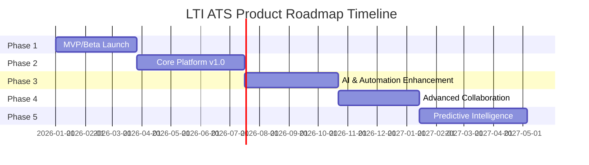
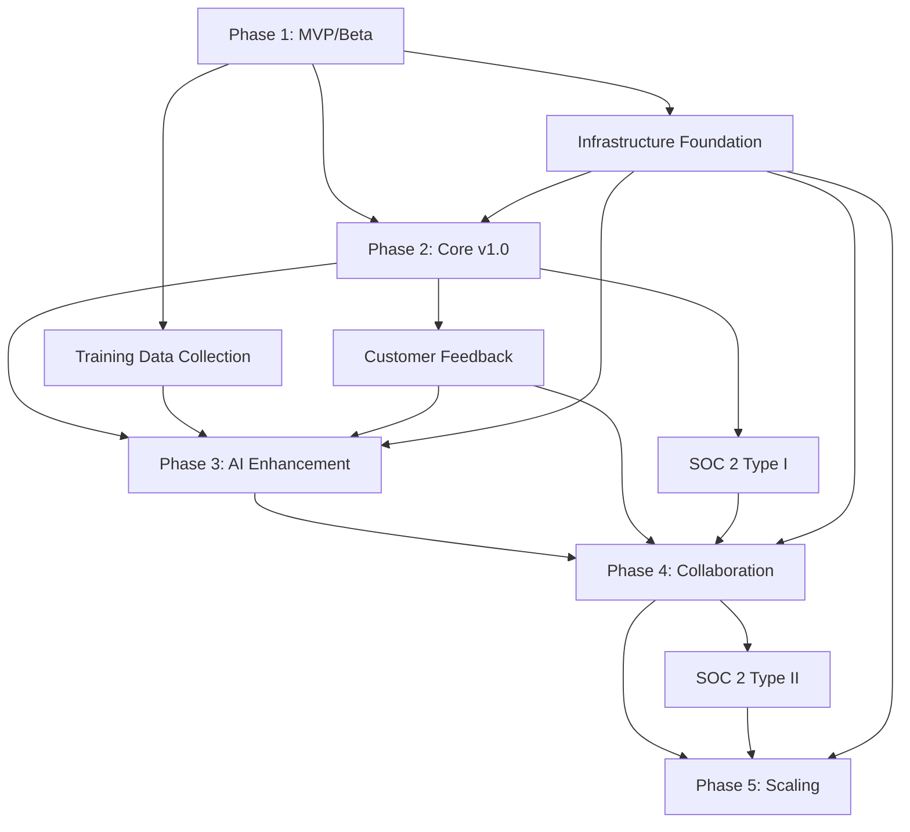

# LTI ATS Product Roadmap
**Version:** 1.0  
**Date:** November 25, 2025  
**Owner:** Product Team

---

## Executive Summary

### Product Vision Alignment

LTI ATS is positioned to become the leading AI-powered recruitment platform by transforming reactive recruitment into an intelligent, collaborative, and data-driven process. The product roadmap is strategically designed to deliver the core value proposition—**reducing time-to-hire by 40%**—through a phased approach that balances rapid time-to-market with sustainable technical foundation and continuous innovation.

### Strategic Roadmap Approach

This roadmap follows a five-phase strategy that prioritizes:
1. **MVP/Beta Launch** to validate product-market fit with early adopters (tech startups, progressive HR teams)
2. **Core Platform v1.0** to establish market presence with P0 features across all 8 feature domains
3. **AI & Automation Enhancement** to deliver on the key differentiator of contextual AI and adaptive automation
4. **Advanced Collaboration & Integrations** to expand market reach and enable enterprise adoption
5. **Predictive Intelligence & Scaling** to achieve market leadership through advanced analytics and global scalability

Each phase builds upon the previous foundation, ensuring technical debt is minimized while delivering incremental business value. The roadmap accounts for cross-cutting concerns (security, compliance, performance, observability) from day one, ensuring enterprise-readiness and regulatory compliance throughout the product lifecycle.

### Key Success Factors

Success is measured through a balanced scorecard approach covering product metrics (MRR, ARR, customer acquisition), usage metrics (DAU, time-to-hire reduction, feature adoption), technical metrics (uptime, response time, deployment frequency), and customer success metrics (onboarding completion, support resolution, health scores). The roadmap is designed to achieve $500K MRR and 200 customers by end of Year 1, with a clear path to $6M ARR.

---

## Roadmap Overview

### Visual Timeline

### Phase Summary

| Phase | Duration | Primary Goal | Key Deliverables | Target Segment |
|-------|----------|--------------|------------------|----------------|
| **Phase 1: MVP/Beta** | 12 weeks | Validate product-market fit | Core job management, basic AI screening, pipeline management | Early adopters (50-200 employees) |
| **Phase 2: Core v1.0** | 16 weeks | Establish market presence | Complete P0 features, integrations, analytics | Mid-market (200-2,000 employees) |
| **Phase 3: AI Enhancement** | 14 weeks | Deliver AI differentiation | Advanced matching, cultural fit, predictive analytics | Progressive mid-market |
| **Phase 4: Collaboration** | 12 weeks | Enable enterprise adoption | Real-time collaboration, video interviews, advanced integrations | Enterprise & agencies |
| **Phase 5: Scaling** | 16 weeks | Achieve market leadership | Multi-region, advanced analytics, workforce planning | Global enterprises |

---

## Phase 1 — MVP / Beta Launch

### Goals

Deliver a minimum viable product that demonstrates core value proposition to early adopters, focusing on the essential recruitment workflow from job posting to candidate evaluation. The MVP must prove the 40% time-to-hire reduction claim through intelligent automation and streamlined processes.

### Business Value

- **Validate Product-Market Fit**: Engage 20-30 design partners to validate core assumptions
- **Build Case Studies**: Generate proof points for sales and marketing
- **Establish Technical Foundation**: Create scalable architecture for future phases
- **Early Revenue**: Target $50K MRR from beta customers
- **Competitive Positioning**: Demonstrate AI differentiation vs. legacy ATS platforms

### Key Deliverables

#### Job Management (MVP Scope)
- **JM-001**: Job requisition creation with intelligent templates
- **JM-002**: Basic approval workflow (single-step)
- **JM-003**: Multi-channel publishing (LinkedIn, Indeed, company careers page)

#### Sourcing & Attraction (MVP Scope)
- **SA-001**: Advanced candidate search with Boolean operators
- **SA-002**: External platform integration (LinkedIn Recruiter, Indeed)

#### Intelligent Screening (MVP Scope)
- **IS-001**: Automated CV parsing (PDF, DOC, DOCX)
- **IS-002**: AI matching score (basic algorithm)

#### Collaborative Evaluation (MVP Scope)
- **CE-001**: Customizable scorecards (basic templates)
- **CE-002**: Real-time commenting on candidate profiles
- **CE-005**: Consolidated decision view

#### Pipeline Management (MVP Scope)
- **PM-001**: Visual Kanban board with drag-and-drop
- **PM-002**: Automated workflows (basic email triggers)

#### Communication (MVP Scope)
- **CM-001**: Email templates with merge fields
- **CM-002**: Automated email triggers (stage transitions)

#### Analytics & Insights (MVP Scope)
- **AI-001**: Executive dashboard (basic KPIs: time-to-hire, cost-per-hire, source effectiveness)
- **AI-002**: Funnel analysis (conversion rates, bottleneck identification)

#### Integrations (MVP Scope)
- **IN-002**: Calendar integration (Google Calendar, Outlook)
- **IN-006**: RESTful API (core endpoints for job, candidate, application)

### Technical Components

#### Frontend
- React 18 with TypeScript setup
- Material-UI component library integration
- Redux Toolkit for state management
- Responsive layouts for desktop and tablet
- WebSocket client for real-time updates

#### Backend Services
- **Auth Service**: JWT-based authentication, basic RBAC (admin, recruiter, hiring-manager roles)
- **Job Management Service**: Job CRUD, approval workflow engine, publishing API
- **Candidate Service**: Profile management, search indexing, duplicate detection
- **Application Service**: Pipeline state machine, stage transitions, assignment logic
- **Evaluation Service**: Scorecard templates, rating aggregation, comment threads
- **Communication Service**: Email template engine, SMTP integration, delivery tracking

#### AI/ML Layer (MVP)
- **CV Parser**: spaCy-based entity extraction, structured data mapping
- **Matching Engine**: TF-IDF based scoring with skill weighting (v1 algorithm)

#### Data Layer
- PostgreSQL 14 schema (core entities: Job, Candidate, Application, Stage, Evaluation, User, Communication)
- Redis for session storage and caching
- ElasticSearch for candidate search
- AWS S3 for resume storage

#### Infrastructure
- Kubernetes cluster (development and staging environments)
- Docker containerization for all services
- GitHub Actions CI/CD pipeline
- Terraform infrastructure as code
- Basic monitoring (Prometheus + Grafana)

### Cross-Functional Considerations

#### Security
- OAuth 2.0 authentication for API
- JWT tokens with 1-hour expiration
- TLS 1.3 for all communications
- AES-256 encryption at rest
- RBAC with granular permissions
- Security headers (CORS, CSP, HSTS)

#### Compliance
- GDPR consent management (candidate data processing)
- Data retention policies (configurable by customer)
- Audit logs for sensitive operations
- Right to erasure implementation (soft delete with purge)

#### Performance
- API response time < 300ms (p95) for MVP
- Page load time < 3 seconds
- Support 500 concurrent users
- Database query optimization (indexed fields, query planning)

#### Observability
- Centralized logging (ELK Stack)
- Application metrics (Prometheus)
- Distributed tracing (Jaeger) for critical paths
- Error tracking (Sentry)
- Health check endpoints for all services

#### Scalability
- Stateless service design
- Horizontal pod autoscaling (HPA) configuration
- Database connection pooling
- CDN for static assets

### Timeline Estimate

**Duration**: 12 weeks (3 months)

| Milestone | Duration | Dependencies |
|-----------|----------|--------------|
| Architecture & Infrastructure Setup | 2 weeks | None |
| Core Backend Services Development | 4 weeks | Infrastructure |
| Frontend Application Development | 4 weeks | Backend APIs (parallel) |
| AI/ML Model Training & Integration | 3 weeks | CV parsing data collection |
| Integration Testing & Bug Fixes | 2 weeks | All development complete |
| Beta Customer Onboarding | 1 week | Testing complete |

### Success Metrics

- 20-30 design partners onboarded
- 90% of beta users complete core workflow (job posting → candidate evaluation)
- Average time-to-hire reduction of 30% (vs. previous system)
- System uptime > 99%
- API response time < 300ms (p95)
- Zero critical security vulnerabilities
- 3-5 customer case studies documented

---

## Phase 2 — Core Platform v1.0

### Goals

Deliver a production-ready, enterprise-grade ATS platform with complete P0 feature coverage across all 8 domains. Achieve general availability (GA) and scale to 100+ customers with robust integrations, comprehensive analytics, and proven reliability.

### Business Value

- **Market Entry**: Public launch with full marketing activation
- **Revenue Growth**: Target $250K MRR by end of phase
- **Customer Expansion**: Onboard 100 customers (mid-market focus)
- **Product Maturity**: Achieve SOC 2 Type I readiness
- **Competitive Differentiation**: Complete AI-powered screening and matching
- **Partner Ecosystem**: Establish integration marketplace

### Key Deliverables

#### Job Management (Complete P0)
- **JM-002**: Multi-step approval workflow with configurable chains
- **JM-004**: Market analysis (salary benchmarking, competitive insights)

#### Sourcing & Attraction (Complete P0)
- Duplicate candidate detection and merging
- Saved search filters and alerts
- Search result ranking optimization

#### Intelligent Screening (Complete P0)
- Multi-language CV parsing (English, Spanish, Portuguese)
- Enhanced AI matching with continuous learning
- Matching score explanation and transparency

#### Collaborative Evaluation (Complete P0)
- Weighted scoring criteria
- @mentions and notification system
- Interview scheduling integration
- Side-by-side candidate comparison

#### Pipeline Management (Complete P0)
- Customizable pipeline stages per job
- Conditional workflow logic
- Bulk operations (stage transitions, email sending)
- Candidate filters and saved views

#### Communication (Complete P0)
- HTML email editor
- Delivery tracking (sent, opened, clicked)
- Unsubscribe management
- Email template library expansion

#### Analytics & Insights (Complete P0)
- Customizable date ranges and filters
- Export to PDF/Excel
- Time spent per stage analysis
- Drop-off reasons tracking

#### Integrations (Complete P0)
- **IN-001**: HRIS integration (BambooHR, Workday)
- **IN-006**: Comprehensive RESTful API with OpenAPI docs, webhooks, rate limiting

### Technical Components

#### Frontend Enhancements
- Mobile-responsive design (all features)
- React Query for server state management
- Optimistic UI updates
- Offline capability (basic)
- Accessibility compliance (WCAG 2.1 AA)

#### Backend Services Enhancements
- **Workflow Engine**: Business process orchestration, conditional logic
- **Scheduler Service**: Recurring jobs, follow-ups, reminders
- **Integration Hub**: HRIS connectors, webhook management
- **Analytics Service**: Metrics aggregation, report generation

#### AI/ML Layer Enhancements
- **Matching Engine v2**: Neural network-based scoring, historical success patterns
- **Insights Generator**: Candidate recommendations, job optimization suggestions
- **NLP Service**: Basic sentiment analysis on comments

#### Data Layer Enhancements
- Data warehouse setup (Snowflake/BigQuery)
- Historical data archival strategy
- Database replication for read scaling
- Backup and disaster recovery automation

#### Infrastructure Enhancements
- Production Kubernetes cluster (multi-zone)
- Auto-scaling policies (CPU, memory, custom metrics)
- Blue-green deployment strategy
- CDN integration (CloudFront/CloudFlare)

### Cross-Functional Considerations

#### Security
- Multi-factor authentication (MFA) for all users
- SSO support (SAML 2.0, OAuth 2.0)
- Penetration testing (initial assessment)
- OWASP Top 10 compliance validation
- PII data anonymization in logs

#### Compliance
- SOC 2 Type I audit preparation
- CCPA compliance (California)
- EEO/EEOC reporting capabilities
- Data processing agreements (DPA) templates

#### Performance
- API response time < 200ms (p95)
- Page load time < 2 seconds
- Support 5,000 concurrent users
- Search results < 500ms
- Database query optimization (materialized views, query caching)

#### Observability
- Custom dashboards for business metrics
- Alerting rules (PagerDuty integration)
- SLO/SLI definitions and tracking
- Performance profiling and APM (New Relic/Datadog)

#### Scalability
- Multi-region deployment capability
- Database sharding strategy (designed, not implemented)
- Message queue for async processing (RabbitMQ)
- Cache warming strategies

### Timeline Estimate

**Duration**: 16 weeks (4 months)

| Milestone | Duration | Dependencies |
|-----------|----------|--------------|
| Enhanced AI Model Development | 4 weeks | Phase 1 data collection |
| Backend Services Completion | 6 weeks | AI models |
| Frontend Feature Completion | 6 weeks | Backend APIs (parallel) |
| Integration Development | 4 weeks | Backend services |
| Security Hardening & Compliance | 3 weeks | Feature complete |
| Performance Testing & Optimization | 2 weeks | All development |
| SOC 2 Type I Preparation | 4 weeks | Parallel with development |
| GA Launch Preparation | 2 weeks | Testing complete |

### Success Metrics

- 100+ customers onboarded
- $250K MRR achieved
- 95% customer onboarding completion within 30 days
- Average time-to-hire reduction of 35%
- System uptime 99.9%
- API response time < 200ms (p95)
- 70% DAU (daily active users)
- NPS > 40
- SOC 2 Type I certification obtained

---

## Phase 3 — AI & Automation Enhancement

### Goals

Deliver advanced AI capabilities that differentiate LTI ATS from competitors, focusing on contextual intelligence, adaptive automation, and predictive insights. Transform the platform from a workflow tool to an intelligent hiring assistant.

### Business Value

- **AI Differentiation**: Establish market leadership in AI-powered recruiting
- **Customer Value**: Achieve 40% time-to-hire reduction target
- **Upsell Opportunity**: Premium AI features for higher-tier plans
- **Competitive Moat**: Proprietary algorithms and continuous learning
- **Expansion Revenue**: 15% of ARR from existing customer upgrades

### Key Deliverables

#### Intelligent Screening (P1 Features)
- **IS-003**: Cultural fit analysis (NLP-based compatibility assessment)
- **IS-004**: Red flag detection (employment gaps, inconsistencies)
- Advanced matching with explainable AI
- Bias detection and mitigation algorithms

#### Pipeline Management (P1 Features)
- **PM-003**: Intelligent assignment (AI-powered candidate-to-recruiter matching)
- **PM-004**: Proactive alerts (stalled candidates, suggested actions)
- Predictive stage duration estimates

#### Communication (P1 Features)
- **CM-004**: Smart scheduling (AI-powered interview scheduling with availability detection)
- **CM-005**: Multi-channel notifications (SMS, WhatsApp)
- Email content optimization (A/B testing, send time optimization)

#### Analytics & Insights (P1 + P2 Features)
- **AI-003**: Source ROI tracking (cost per hire by source, source comparison matrix)
- **AI-004**: Diversity metrics (DEI analytics, compliance reporting)
- **AI-005**: Predictive analytics (time-to-close predictions, drop-off probability, confidence scores)
- **AI-006**: Custom reports (drag-and-drop report builder, scheduled reports)

#### Sourcing & Attraction (P1 Features)
- **SA-003**: Chrome extension (one-click profile import from LinkedIn)
- **SA-004**: Talent pools (segmented communities, automated nurturing, engagement metrics)

### Technical Components

#### AI/ML Layer (Advanced)
- **Matching Engine v3**: Transformer-based semantic matching, context-aware scoring
- **Cultural Fit Analyzer**: BERT-based NLP model for culture compatibility
- **Red Flag Detector**: Anomaly detection algorithms, pattern recognition
- **Predictive Models**: Time-series forecasting (time-to-hire, drop-off probability)
- **Bias Detection**: Fairness metrics, demographic parity analysis
- **Recommendation Engine**: Collaborative filtering for candidate suggestions

#### Backend Services (AI-Focused)
- **ML Model Serving**: TensorFlow Serving / TorchServe for model deployment
- **Feature Store**: Centralized feature management for ML models
- **A/B Testing Framework**: Experimentation platform for AI features
- **Feedback Loop**: Continuous learning from hiring outcomes

#### Frontend Enhancements
- AI insights visualization (explainable AI dashboards)
- Interactive report builder
- Real-time notifications (WebSocket)
- Chrome extension development

#### Data Layer Enhancements
- ML training data pipeline
- Feature engineering infrastructure
- Model versioning and registry (MLflow)
- Data labeling and annotation tools

### Cross-Functional Considerations

#### Security
- AI model security (adversarial attack prevention)
- Data privacy in ML training (differential privacy)
- Model explainability for compliance

#### Compliance
- AI bias auditing (quarterly reviews)
- Explainable AI documentation
- Fairness metrics reporting
- EEOC compliance validation

#### Performance
- ML inference latency < 100ms
- Real-time prediction serving
- Model caching strategies
- GPU acceleration for training

#### Observability
- ML model performance monitoring
- Prediction accuracy tracking
- Data drift detection
- Model retraining triggers

#### Scalability
- Distributed model training
- Model serving auto-scaling
- Feature store scalability

### Timeline Estimate

**Duration**: 14 weeks (3.5 months)

| Milestone | Duration | Dependencies |
|-----------|----------|--------------|
| ML Infrastructure Setup | 2 weeks | Phase 2 complete |
| Advanced ML Model Development | 6 weeks | Training data collection |
| AI Feature Integration | 4 weeks | ML models ready |
| Chrome Extension Development | 3 weeks | Parallel with AI features |
| Bias Detection & Fairness Testing | 3 weeks | ML models deployed |
| Performance Optimization | 2 weeks | All features complete |
| User Acceptance Testing | 2 weeks | Testing complete |

### Success Metrics

- 40% average time-to-hire reduction achieved
- 80% of customers using AI features
- AI matching accuracy > 85% (validated against hiring outcomes)
- Bias metrics within acceptable thresholds (demographic parity > 0.8)
- Chrome extension: 5,000+ installs
- Talent pool engagement rate > 25%
- Predictive analytics accuracy > 75%
- Customer satisfaction with AI features > 4.2/5

---

## Phase 4 — Advanced Collaboration & Integrations

### Goals

Enable enterprise adoption through advanced collaboration features, comprehensive integration marketplace, and white-label capabilities. Position LTI ATS as the platform of choice for large organizations and recruitment agencies.

### Business Value

- **Enterprise Market Entry**: Target companies with 2,000+ employees
- **Agency Market**: Onboard 20+ recruitment agencies
- **Integration Revenue**: Marketplace with premium integrations
- **Strategic Partnerships**: HRIS vendors, assessment platforms
- **Revenue Growth**: Target $400K MRR

### Key Deliverables

#### Collaborative Evaluation (P1 Features)
- **CE-003**: Video interview platform (asynchronous video, sentiment analysis, transcription)
- **CE-004**: Assessment integration (Codility, HackerRank, automatic score import)
- Live debrief sessions with synchronized data
- Collaborative decision workflows

#### Integrations (P1 Features)
- **IN-003**: Communication tools (Slack, Microsoft Teams with slash commands)
- **IN-004**: Background check providers (Checkr, Sterling)
- **IN-005**: Assessment platforms (expanded coverage)
- Integration marketplace (self-service connector installation)
- Zapier integration for workflow automation

#### Pipeline Management (Enhanced)
- Advanced bulk operations
- Custom pipeline templates
- Pipeline analytics and optimization

#### Communication (Enhanced)
- In-app messaging between team members
- Candidate portal enhancements (two-way messaging)
- Video message support

#### Analytics & Insights (Enhanced)
- Team collaboration metrics
- Interview effectiveness analysis
- Hiring manager performance dashboards

#### Platform Capabilities
- White-label customization (branding, domain)
- Multi-tenant architecture enhancements
- Advanced permission management
- API rate limit customization per customer

### Technical Components

#### Frontend Enhancements
- Video interview UI (WebRTC integration)
- Real-time collaboration features (operational transformation)
- Mobile app (React Native for iOS/Android)
- Candidate portal (dedicated React app)

#### Backend Services (Collaboration)
- **Video Service**: WebRTC signaling server, recording storage, transcription API
- **Real-Time Collaboration Service**: WebSocket server, conflict resolution
- **Integration Marketplace Service**: Connector registry, installation management
- **White-Label Service**: Tenant customization, branding management

#### Integration Layer
- Slack/Teams bot development
- Background check API integration
- Assessment platform connectors
- Zapier app development
- Webhook event system expansion

#### Infrastructure
- Video streaming infrastructure (CDN, transcoding)
- WebSocket scaling (sticky sessions, Redis pub/sub)
- Multi-region deployment (US, EU)

### Cross-Functional Considerations

#### Security
- Video encryption (end-to-end for sensitive interviews)
- Integration OAuth scopes and permissions
- Tenant data isolation (multi-tenant security)
- Third-party security assessments

#### Compliance
- Video recording consent management
- Cross-border data transfer (EU-US Privacy Shield successor)
- SOC 2 Type II audit
- ISO 27001 preparation

#### Performance
- Video streaming latency < 200ms
- WebSocket connection handling (100K+ concurrent)
- Multi-region latency optimization
- CDN for global content delivery

#### Observability
- Integration health monitoring
- Video quality metrics
- Real-time collaboration performance
- Multi-region monitoring

#### Scalability
- Global load balancing
- Regional data residency
- Cross-region replication
- Video storage optimization

### Timeline Estimate

**Duration**: 12 weeks (3 months)

| Milestone | Duration | Dependencies |
|-----------|----------|--------------|
| Video Interview Platform Development | 5 weeks | Phase 3 complete |
| Integration Marketplace Development | 4 weeks | Parallel with video |
| Mobile App Development | 6 weeks | Parallel with other features |
| White-Label Capabilities | 3 weeks | Multi-tenant enhancements |
| Multi-Region Deployment | 4 weeks | Infrastructure setup |
| SOC 2 Type II Audit | 12 weeks | Parallel with development |
| Enterprise Customer Pilots | 4 weeks | Feature complete |

### Success Metrics

- 20+ enterprise customers (2,000+ employees)
- 10+ recruitment agencies onboarded
- 50+ integrations in marketplace
- Mobile app: 10,000+ downloads
- Video interview adoption: 60% of customers
- Multi-region deployment: < 100ms latency globally
- SOC 2 Type II certification obtained
- $400K MRR achieved
- NPS > 50

---

## Phase 5 — Predictive Intelligence & Scaling

### Goals

Achieve market leadership through advanced predictive analytics, workforce planning capabilities, and global scalability. Position LTI ATS as the strategic hiring platform for data-driven organizations.

### Business Value

- **Market Leadership**: Top 3 ATS platform by innovation
- **Strategic Value**: Shift from tactical tool to strategic platform
- **Global Expansion**: Support for 50+ countries
- **Revenue Growth**: Target $500K+ MRR
- **Customer Retention**: < 3% annual churn

### Key Deliverables

#### Advanced Analytics & Workforce Planning
- Predictive workforce planning (hiring demand forecasting)
- Skills gap analysis and recommendations
- Succession planning integration
- Talent market intelligence (external data integration)
- Competitive hiring intelligence

#### Internal Mobility & Talent Marketplace
- Internal candidate matching
- Career pathing recommendations
- Skills development tracking
- Internal referral program management

#### Global Platform Capabilities
- Multi-language support (10+ languages)
- Multi-currency and localization
- Regional compliance (50+ countries)
- Global talent pool management

#### Advanced AI Capabilities
- Resume quality scoring and improvement suggestions
- Interview question generator (AI-powered)
- Automated reference checking (AI-assisted)
- Candidate engagement prediction

#### Platform Maturity
- Advanced API capabilities (GraphQL, gRPC)
- Developer portal and documentation
- SDK libraries (Python, JavaScript, Ruby)
- Marketplace for third-party apps

### Technical Components

#### AI/ML Layer (Advanced Intelligence)
- **Workforce Planning Models**: Time-series forecasting, demand prediction
- **Skills Intelligence**: Skills taxonomy, gap analysis, career pathing
- **Engagement Prediction**: Candidate response likelihood, drop-off prevention
- **Market Intelligence**: External data integration, competitive analysis

#### Backend Services (Strategic)
- **Workforce Planning Service**: Forecasting, scenario modeling
- **Internal Mobility Service**: Employee matching, career pathing
- **Market Intelligence Service**: External data aggregation, trend analysis
- **Developer Platform Service**: API management, SDK distribution

#### Data Layer (Enterprise Scale)
- Multi-region database deployment
- Data lake for advanced analytics
- Real-time data streaming (Kafka)
- Advanced data governance

#### Infrastructure (Global Scale)
- Multi-region active-active deployment
- Global CDN optimization
- Edge computing for low-latency AI
- Disaster recovery automation

### Cross-Functional Considerations

#### Security
- Global security compliance (ISO 27001)
- Regional data sovereignty
- Advanced threat detection
- Zero-trust architecture

#### Compliance
- 50+ country regulatory compliance
- Industry-specific compliance (healthcare, finance)
- Continuous compliance monitoring
- Automated compliance reporting

#### Performance
- Global latency < 100ms (p95)
- Support 50,000+ concurrent users
- 10M+ candidate profiles
- Real-time analytics on billions of data points

#### Observability
- Global monitoring and alerting
- Predictive incident detection
- Business intelligence dashboards
- Customer usage analytics

#### Scalability
- Auto-scaling across regions
- Database sharding implementation
- Microservices decomposition
- Event-driven architecture maturity

### Timeline Estimate

**Duration**: 16 weeks (4 months)

| Milestone | Duration | Dependencies |
|-----------|----------|--------------|
| Workforce Planning Development | 6 weeks | Phase 4 complete |
| Internal Mobility Platform | 5 weeks | Parallel with workforce planning |
| Global Platform Capabilities | 6 weeks | Localization, compliance |
| Advanced AI Models | 6 weeks | Parallel with platform features |
| Multi-Region Deployment | 8 weeks | Infrastructure expansion |
| Developer Platform | 4 weeks | API enhancements |
| Enterprise Scaling | 4 weeks | Performance optimization |
| Market Leadership Campaign | 8 weeks | Parallel with development |

### Success Metrics

- $500K+ MRR achieved
- 200+ customers total
- 50+ countries supported
- 10M+ candidate profiles
- 99.95% uptime achieved
- < 3% annual churn
- NPS > 60
- Top 3 ATS platform ranking (G2, Capterra)
- 30+ third-party apps in marketplace
- Developer community: 1,000+ registered developers

---

## Cross-Cutting Concerns

### Security (All Phases)

#### Authentication & Authorization
- **Phase 1**: JWT-based auth, basic RBAC
- **Phase 2**: MFA, SSO (SAML, OAuth)
- **Phase 3**: Advanced permission management
- **Phase 4**: Multi-tenant security, integration OAuth
- **Phase 5**: Zero-trust architecture, adaptive authentication

#### Data Protection
- **Phase 1**: TLS 1.3, AES-256 encryption at rest
- **Phase 2**: PII anonymization, field-level encryption
- **Phase 3**: Differential privacy for ML training
- **Phase 4**: End-to-end encryption for video
- **Phase 5**: Homomorphic encryption research

#### Security Testing
- **Phase 1**: Basic security scanning in CI/CD
- **Phase 2**: Penetration testing (initial)
- **Phase 3**: Quarterly pen testing, bug bounty program
- **Phase 4**: Third-party security assessments
- **Phase 5**: Continuous security validation, red team exercises

### Compliance (All Phases)

#### Data Privacy
- **Phase 1**: GDPR consent management, right to erasure
- **Phase 2**: CCPA compliance, data portability
- **Phase 3**: AI bias auditing, explainability
- **Phase 4**: Cross-border data transfer compliance
- **Phase 5**: Global privacy compliance (50+ countries)

#### Certifications
- **Phase 1**: Basic compliance documentation
- **Phase 2**: SOC 2 Type I
- **Phase 3**: SOC 2 Type I maintenance
- **Phase 4**: SOC 2 Type II
- **Phase 5**: ISO 27001, industry-specific certifications

#### Employment Law
- **Phase 1**: Basic EEO/EEOC reporting
- **Phase 2**: Audit logs for compliance
- **Phase 3**: Advanced diversity analytics
- **Phase 4**: Multi-jurisdiction compliance
- **Phase 5**: Automated compliance monitoring

### Performance (All Phases)

#### Response Time Targets
- **Phase 1**: API < 300ms (p95), Page load < 3s
- **Phase 2**: API < 200ms (p95), Page load < 2s
- **Phase 3**: ML inference < 100ms
- **Phase 4**: Video streaming < 200ms latency
- **Phase 5**: Global latency < 100ms (p95)

#### Throughput Targets
- **Phase 1**: 500 concurrent users
- **Phase 2**: 5,000 concurrent users
- **Phase 3**: 10,000 concurrent users
- **Phase 4**: 25,000 concurrent users
- **Phase 5**: 50,000+ concurrent users

#### Optimization Strategies
- **Phase 1**: Database indexing, query optimization
- **Phase 2**: Caching strategies, CDN integration
- **Phase 3**: ML model optimization, GPU acceleration
- **Phase 4**: Multi-region deployment, edge caching
- **Phase 5**: Advanced caching, predictive prefetching

### Observability (All Phases)

#### Logging
- **Phase 1**: Centralized logging (ELK Stack)
- **Phase 2**: Structured logging, log aggregation
- **Phase 3**: Log analytics, anomaly detection
- **Phase 4**: Multi-region log aggregation
- **Phase 5**: AI-powered log analysis

#### Monitoring
- **Phase 1**: Basic metrics (Prometheus + Grafana)
- **Phase 2**: Custom business metrics, SLO tracking
- **Phase 3**: ML model monitoring, data drift detection
- **Phase 4**: Global monitoring, cross-region correlation
- **Phase 5**: Predictive incident detection

#### Tracing
- **Phase 1**: Distributed tracing (Jaeger) for critical paths
- **Phase 2**: Comprehensive tracing, performance profiling
- **Phase 3**: ML pipeline tracing
- **Phase 4**: Cross-region tracing
- **Phase 5**: End-to-end business transaction tracing

### Scalability (All Phases)

#### Horizontal Scaling
- **Phase 1**: Stateless services, basic auto-scaling
- **Phase 2**: Advanced auto-scaling, message queue
- **Phase 3**: ML model serving scaling
- **Phase 4**: Multi-region deployment
- **Phase 5**: Global active-active, auto-scaling across regions

#### Data Scaling
- **Phase 1**: Database connection pooling, read replicas
- **Phase 2**: Data warehouse, archival strategy
- **Phase 3**: Feature store, ML data pipeline
- **Phase 4**: Multi-region replication
- **Phase 5**: Database sharding, data lake

#### Architecture Evolution
- **Phase 1**: Microservices foundation
- **Phase 2**: Event-driven architecture
- **Phase 3**: CQRS pattern for analytics
- **Phase 4**: Service mesh (Istio)
- **Phase 5**: Serverless for specific workloads

---

## Timeline Estimates

### Consolidated Timeline

| Phase | Duration | Start (Relative) | End (Relative) | Cumulative Weeks |
|-------|----------|------------------|----------------|------------------|
| Phase 1: MVP/Beta | 12 weeks | Week 0 | Week 12 | 12 |
| Phase 2: Core v1.0 | 16 weeks | Week 12 | Week 28 | 28 |
| Phase 3: AI Enhancement | 14 weeks | Week 28 | Week 42 | 42 |
| Phase 4: Collaboration | 12 weeks | Week 42 | Week 54 | 54 |
| Phase 5: Scaling | 16 weeks | Week 54 | Week 70 | 70 |

**Total Duration**: 70 weeks (~16 months from start to full platform maturity)

### Effort Estimates by Discipline

| Discipline | Phase 1 | Phase 2 | Phase 3 | Phase 4 | Phase 5 | Total |
|------------|---------|---------|---------|---------|---------|-------|
| **Frontend** | 4 weeks | 6 weeks | 4 weeks | 6 weeks | 4 weeks | 24 weeks |
| **Backend** | 4 weeks | 6 weeks | 4 weeks | 5 weeks | 6 weeks | 25 weeks |
| **AI/ML** | 3 weeks | 4 weeks | 6 weeks | 2 weeks | 6 weeks | 21 weeks |
| **DevOps** | 2 weeks | 3 weeks | 2 weeks | 4 weeks | 8 weeks | 19 weeks |
| **QA/Testing** | 2 weeks | 3 weeks | 3 weeks | 4 weeks | 4 weeks | 16 weeks |
| **Design** | 2 weeks | 2 weeks | 2 weeks | 3 weeks | 2 weeks | 11 weeks |

### Team Size Recommendations

| Phase | Frontend | Backend | AI/ML | DevOps | QA | Design | Total |
|-------|----------|---------|-------|--------|----|----|-------|
| Phase 1 | 3 | 4 | 2 | 2 | 2 | 1 | 14 |
| Phase 2 | 4 | 5 | 3 | 2 | 3 | 2 | 19 |
| Phase 3 | 3 | 4 | 4 | 2 | 3 | 1 | 17 |
| Phase 4 | 4 | 5 | 2 | 3 | 3 | 2 | 19 |
| Phase 5 | 3 | 5 | 4 | 4 | 3 | 2 | 21 |

---

## Risks & Mitigation

### Technical Risks

| Risk | Impact | Probability | Phase | Mitigation Strategy |
|------|--------|-------------|-------|---------------------|
| **AI model accuracy below expectations** | High | Medium | Phase 1-3 | Extensive training data collection from beta customers, continuous model improvement, human-in-the-loop validation, fallback to rule-based matching |
| **Scalability bottlenecks at high volume** | High | Low | Phase 2-5 | Load testing from Phase 1, horizontal scaling architecture, performance monitoring, proactive capacity planning |
| **Integration complexity with legacy HRIS** | Medium | High | Phase 2, 4 | Robust API documentation, integration specialists on team, pre-built connectors for top 10 HRIS, professional services offering |
| **Video streaming performance issues** | Medium | Medium | Phase 4 | CDN integration, adaptive bitrate streaming, fallback to external platforms (Zoom, Teams), thorough load testing |
| **Multi-region data consistency** | High | Medium | Phase 5 | Event sourcing architecture, eventual consistency design, conflict resolution strategies, regional data isolation where required |
| **ML model bias and fairness** | High | Medium | Phase 3-5 | Diverse training data, bias detection algorithms, regular fairness audits, explainable AI, human oversight |

### Market Risks

| Risk | Impact | Probability | Phase | Mitigation Strategy |
|------|--------|-------------|-------|---------------------|
| **Competition from established ATS vendors** | High | High | All | Focus on AI differentiation, superior UX, faster innovation cycles, strategic partnerships, competitive pricing for early adopters |
| **Slow customer adoption of AI features** | Medium | Medium | Phase 3 | Comprehensive onboarding, clear value demonstration, gradual feature rollout, success stories, training resources |
| **Market saturation in mid-market segment** | Medium | Low | Phase 4-5 | Expand to enterprise and agency markets, international expansion, vertical-specific solutions |
| **Economic downturn affecting hiring** | High | Low | All | Diversify revenue streams, focus on efficiency value prop, flexible pricing, expand to internal mobility |

### Adoption Risks

| Risk | Impact | Probability | Phase | Mitigation Strategy |
|------|--------|-------------|-------|---------------------|
| **Customer churn due to change management** | Medium | Medium | Phase 2-3 | Strong customer success program, training resources, dedicated onboarding, migration assistance, change management consulting |
| **Low user engagement with platform** | High | Medium | All | Intuitive UX design, user onboarding flows, in-app guidance, gamification, regular feature education |
| **Resistance to AI-driven decisions** | Medium | Medium | Phase 3 | Explainable AI, human-in-the-loop workflows, transparency in scoring, gradual AI introduction, trust-building content |

### Regulatory Risks

| Risk | Impact | Probability | Phase | Mitigation Strategy |
|------|--------|-------------|-------|---------------------|
| **Data privacy regulatory changes** | High | Low | All | Legal team monitoring, flexible data architecture, compliance-first design, regional data residency, privacy by design |
| **AI regulation (EU AI Act, etc.)** | High | Medium | Phase 3-5 | Proactive compliance monitoring, explainable AI, human oversight, documentation, legal counsel |
| **Employment law compliance** | Medium | Medium | All | Configurable compliance features, audit trails, legal partnerships, regional expertise |

---

## Dependencies Map

### Phase Dependencies

### Feature Domain Dependencies

#### Job Management Dependencies
- **Prerequisite**: Auth Service, User Management
- **Enables**: Application Service, Sourcing, Analytics
- **External**: Job board APIs (LinkedIn, Indeed)

#### Sourcing & Attraction Dependencies
- **Prerequisite**: Job Management, Candidate Service
- **Enables**: Application Service, Talent Pools
- **External**: LinkedIn Recruiter API, GitHub API

#### Intelligent Screening Dependencies
- **Prerequisite**: Candidate Service, Application Service
- **Enables**: Pipeline Management, Evaluation
- **External**: CV parsing libraries, ML training data

#### Collaborative Evaluation Dependencies
- **Prerequisite**: Application Service, User Management
- **Enables**: Pipeline Management, Analytics
- **External**: Video platforms (Phase 4), Assessment platforms

#### Pipeline Management Dependencies
- **Prerequisite**: Application Service, Stage Management
- **Enables**: Communication, Analytics
- **External**: None (core functionality)

#### Communication Dependencies
- **Prerequisite**: Application Service, Candidate Service
- **Enables**: Automation, Candidate Experience
- **External**: Email service (SendGrid), SMS provider (Twilio), Calendar APIs

#### Analytics & Insights Dependencies
- **Prerequisite**: All core services (data sources)
- **Enables**: Predictive features, Reporting
- **External**: Data warehouse, BI tools

#### Integrations Dependencies
- **Prerequisite**: Core services with stable APIs
- **Enables**: Enterprise adoption, Ecosystem
- **External**: HRIS APIs, Calendar APIs, Communication platforms

### Technical Dependencies

#### Infrastructure
- **Phase 1**: Kubernetes cluster, PostgreSQL, Redis, ElasticSearch, S3
- **Phase 2**: Data warehouse, Message queue, CDN
- **Phase 3**: ML infrastructure, Feature store, Model registry
- **Phase 4**: Multi-region deployment, Video infrastructure
- **Phase 5**: Global load balancing, Data lake, Edge computing

#### External Services
- **Phase 1**: Email (SendGrid), Storage (AWS S3), Auth (Auth0 optional)
- **Phase 2**: HRIS APIs, Calendar APIs, Payment (Stripe)
- **Phase 3**: ML platforms (SageMaker/Vertex AI), Chrome Web Store
- **Phase 4**: Video (Twilio/Agora), Background checks, Assessment platforms
- **Phase 5**: Market intelligence APIs, Translation services

---

## Success Criteria

### Phase 1 Success Criteria

#### Product Metrics
- ✅ 20-30 design partners onboarded
- ✅ $50K MRR from beta customers
- ✅ 3-5 customer case studies documented

#### Usage Metrics
- ✅ 90% of beta users complete core workflow
- ✅ 30% average time-to-hire reduction
- ✅ 80% feature adoption (core features)

#### Technical Metrics
- ✅ 99% uptime
- ✅ API response time < 300ms (p95)
- ✅ Zero critical security vulnerabilities
- ✅ 70% code coverage

#### Customer Success Metrics
- ✅ 95% onboarding completion
- ✅ 90% support ticket resolution within 24 hours
- ✅ Customer health score > 7/10

### Phase 2 Success Criteria

#### Product Metrics
- ✅ 100+ customers onboarded
- ✅ $250K MRR achieved
- ✅ < 5% monthly churn
- ✅ NPS > 40

#### Usage Metrics
- ✅ 70% DAU (daily active users)
- ✅ 35% average time-to-hire reduction
- ✅ 60% feature adoption (AI features)
- ✅ 85% candidate application completion

#### Technical Metrics
- ✅ 99.9% uptime
- ✅ API response time < 200ms (p95)
- ✅ Bug escape rate < 3%
- ✅ MTTR < 2 hours
- ✅ 80% code coverage

#### Customer Success Metrics
- ✅ 95% onboarding completion within 30 days
- ✅ Customer health score > 8/10
- ✅ SOC 2 Type I certification

### Phase 3 Success Criteria

#### Product Metrics
- ✅ 150+ customers
- ✅ $350K MRR
- ✅ NPS > 45

#### Usage Metrics
- ✅ 40% average time-to-hire reduction (target achieved)
- ✅ 80% of customers using AI features
- ✅ Chrome extension: 5,000+ installs
- ✅ Talent pool engagement rate > 25%

#### Technical Metrics
- ✅ AI matching accuracy > 85%
- ✅ Bias metrics within acceptable thresholds (demographic parity > 0.8)
- ✅ ML inference latency < 100ms
- ✅ Predictive analytics accuracy > 75%

#### Customer Success Metrics
- ✅ Customer satisfaction with AI features > 4.2/5
- ✅ Expansion revenue: 10% of ARR

### Phase 4 Success Criteria

#### Product Metrics
- ✅ 175+ customers (including 20+ enterprise, 10+ agencies)
- ✅ $400K MRR
- ✅ NPS > 50

#### Usage Metrics
- ✅ Mobile app: 10,000+ downloads
- ✅ Video interview adoption: 60% of customers
- ✅ 50+ integrations in marketplace

#### Technical Metrics
- ✅ Multi-region latency < 100ms globally
- ✅ WebSocket connections: 100K+ concurrent
- ✅ Video streaming latency < 200ms
- ✅ SOC 2 Type II certification

#### Customer Success Metrics
- ✅ Enterprise customer health score > 8.5/10
- ✅ Expansion revenue: 15% of ARR

### Phase 5 Success Criteria

#### Product Metrics
- ✅ 200+ customers
- ✅ $500K+ MRR
- ✅ $6M ARR (annual target)
- ✅ < 3% annual churn
- ✅ NPS > 60
- ✅ Top 3 ATS platform ranking

#### Usage Metrics
- ✅ 50+ countries supported
- ✅ 10M+ candidate profiles
- ✅ 30+ third-party apps in marketplace
- ✅ Developer community: 1,000+ registered developers

#### Technical Metrics
- ✅ 99.95% uptime
- ✅ Global latency < 100ms (p95)
- ✅ Support 50,000+ concurrent users
- ✅ Real-time analytics on billions of data points

#### Customer Success Metrics
- ✅ Customer lifetime value (CLV) > $50K
- ✅ Customer acquisition cost (CAC) < $10K
- ✅ Expansion revenue: 20% of ARR

---

## Alignment with Future Vision

### Version 1.1 (Q2 2026) — Covered in Phase 4
- ✅ Advanced reporting and custom dashboards (Phase 3-4)
- ✅ Mobile app for recruiters (Phase 4)
- ✅ WhatsApp integration (Phase 3)
- ✅ Expanded language support (Phase 5)

### Version 1.2 (Q3 2026) — Covered in Phase 4-5
- ✅ Video interviewing platform (Phase 4)
- ✅ AI-powered interview question generator (Phase 5)
- ✅ Enhanced diversity analytics (Phase 3)
- ✅ Skills taxonomy and career pathing (Phase 5)

### Version 2.0 (Q4 2026) — Covered in Phase 5
- ✅ Predictive workforce planning (Phase 5)
- ✅ Internal mobility and talent marketplace (Phase 5)
- ✅ Referral program management (Phase 5)
- ✅ Candidate relationship management (Phase 5)

### Future Considerations — Beyond Phase 5
- AI-powered resume builder for candidates
- Virtual reality interview environments
- Blockchain-based credential verification
- Gig economy and contractor management

---

## Conclusion

This product roadmap provides a clear, structured path from MVP to market leadership over 70 weeks (~16 months). Each phase builds upon the previous foundation, delivering incremental business value while maintaining technical excellence and regulatory compliance.

**Key Success Factors**:
1. **Customer-Centric Development**: Continuous feedback loops with design partners and customers
2. **AI Differentiation**: Proprietary algorithms and continuous learning from hiring outcomes
3. **Enterprise-Ready**: Security, compliance, and scalability from day one
4. **Global Ambition**: Multi-region, multi-language, multi-compliance from Phase 4
5. **Ecosystem Strategy**: Integration marketplace and developer platform for long-term moat

**Next Steps**:
1. Secure funding and team hiring for Phase 1
2. Recruit 20-30 design partners for beta program
3. Finalize technical architecture and infrastructure setup
4. Begin development sprint planning for Phase 1
5. Establish success metrics tracking and reporting cadence

---

**Document Prepared By**: Product Team  
**Review Date**: November 25, 2025  
**Next Review**: End of Phase 1 (Week 12)
